# Clothes Marketplace

Clothes Marketplace to aplikacja webowa typu Vinted przeznaczona do wystawiania, przeglądania i zarządzania ogłoszeniami
z odzieżą. System umożliwia użytkownikom dodawanie własnych ofert sprzedaży, filtrowanie produktów według podstawowych
parametrów, sortowanie oraz zarządzanie ogłoszeniami z poziomu konta użytkownika. Administrator ma dodatkowo dostęp do
panelu administracyjnego, w którym może zarządzać kategoriami i ogłoszeniami.

Aplikacja rozwiązuje problem prostego publikowania i wyszukiwania ogłoszeń odzieżowych w jednym miejscu. W odróżnieniu
od bardzo rozbudowanych serwisów sprzedażowych projekt skupia się na przejrzystej strukturze, prostym CRUD, walidacji
danych, autoryzacji dostępu oraz praktycznym filtrowaniu ogłoszeń.

---

## Uruchomienie projektu (developer)

### Użyte technologie

| Element                 | Technologia / wersja | link                                                    |
|-------------------------|---------------------:|---------------------------------------------------------|
| Backend                 |           PHP 8.2.12 | https://www.php.net/distributions/php-8.2.12.tar.gz     |
| Framework backendowy    |      Laravel 12.56.0 | https://github.com/laravel/installer                    |
| Menedżer zależności PHP |       Composer 2.9.5 | https://getcomposer.org/download/2.9.5/composer.phar    |
| Baza danych             |      PostgreSQL 18.1 | https://sbp.enterprisedb.com/getfile.jsp?fileid=1260147 |

### Wymagania programowe

Do uruchomienia projektu na czystym komputerze potrzebne są:

1. PHP w wersji 8.2
2. Composer
3. PostgreSQL
4. Git lub możliwość pobrania projektu jako archiwum ZIP
5. Terminal

W pliku `php.ini` upewnić się, że aktywne są rozszerzenia:

```ini
extension = pdo_pgsql
extension = pgsql
```

Po zmianie `php.ini` należy zrestartować terminal

---

## Proces instalacji

### 1. Pobranie projektu

Stworzyć folder, odtworzyć w tym folderze terminal wpisać:

```
git clone https://github.com/kayor1x/Projekt_AI_Sklep_Odziezowy.git
cd Projekt_AI_Sklep_Odziezowy
```

### 2. Instalacja zależności PHP

```
composer install
```

---

## Proces konfiguracji

### 1. Utworzenie pliku środowiskowego

Należy skopiować plik `.env.example` do `.env`:

```
Copy-Item .env.example .env
```

### 2. Wygenerowanie klucza aplikacji

```
php artisan key:generate
```

### 3. Konfiguracja bazy danych

W PostgreSQL należy utworzyć bazę danych, np.:

```sql
CREATE DATABASE clothes_marketplace;
```

Następnie w pliku `.env` należy ustawić dane połączenia:

```env
DB_CONNECTION=pgsql
DB_HOST=127.0.0.1
DB_PORT=5432
DB_DATABASE=clothes_marketplace
DB_USERNAME=*wprowadzic swoje dane*
DB_PASSWORD=*wprowadzic swoje dane*
```

### 4. Migracje i dane początkowe

Aby utworzyć strukturę bazy danych i dodać dane początkowe, należy wykonać:

```
php artisan migrate:fresh --seed
```

Komenda tworzy tabele oraz dodaje podstawowe kategorie i konta demonstracyjne.

### 5. Link do zdjęć w katalogu publicznym

Zdjęcia ogłoszeń są przechowywane na publicznym dysku Laravel. Żeby przeglądarka mogła je wyświetlać, należy wykonać:

```
php artisan storage:link
```

Jeżeli link już istnieje i występują problemy ze zdjęciami, można go usunąć i utworzyć ponownie:

```
Remove-Item public/storage -Force
php artisan storage:link
```

### 6. Uruchomienie projektu

```
php artisan serve
```

Aplikacja będzie dostępna pod adresem:

```
http://127.0.0.1:8000
```

---

## Domyślne konta użytkowników

Po wykonaniu seedów dostępne są przykładowe konta:

| Rola          | E-mail                 | Hasło      |
|---------------|------------------------|------------|
| Administrator | `admin@example.com`    | `password` |
| Użytkownik    | `jan@example.com`      | `password` |
| Użytkownik    | `yevhenii@example.com` | `password` |

Administrator ma dostęp do panelu `/admin`. Zwykły użytkownik może tworzyć i edytować tylko własne ogłoszenia.

---

## Uruchomienie projektu (user)

Aplikacja nie została wdrożona na publiczny serwer.  
Z tego powodu użytkownik końcowy nie ma możliwości uruchomienia jej bezpośrednio przez link w internecie.

Aplikacja może być używana lokalnie po wcześniejszym uruchomieniu projektu przez developera. Szczegółowy sposób
uruchomienia znajduje się w sekcji [Uruchomienie projektu (developer)](#uruchomienie-projektu-developer). Po
konfiguracji jest dostępna w przeglądarce pod adresem:

```
http://127.0.0.1:8000
```

---

## Podręcznik użytkownika

### Role w systemie

#### Gość

Gość, czyli niezalogowany użytkownik, może:

- przeglądać publiczne ogłoszenia;
- otwierać szczegóły ogłoszenia;
- korzystać z wyszukiwarki i filtrów;
- przejść do logowania albo rejestracji.

Gość nie może:

- dodawać ogłoszeń;
- edytować ogłoszeń;
- usuwać ogłoszeń;
- korzystać z panelu administracyjnego.

#### Zalogowany użytkownik

Zalogowany użytkownik może:

- dodać nowe ogłoszenie;
- edytować własne ogłoszenia;
- usuwać własne ogłoszenia;
- przeglądać swój dashboard;
- aktualizować dane profilu;
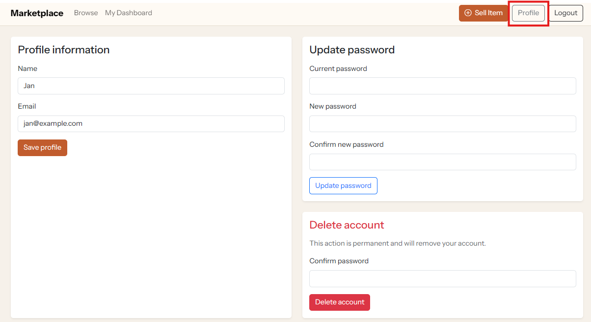
- usunąć konto.
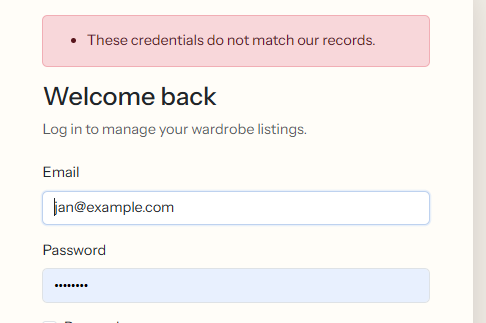


Użytkownik nie może edytować ani usuwać ogłoszeń innych osób.

#### Administrator

Administrator może:

- wejść do panelu administratora;
- zarządzać kategoriami;
- przeglądać, edytować i usuwać wszystkie ogłoszenia;
- widzieć ilość użytkowników, ogłoszeń, kategorii

---

## User flow: Przeglądanie ogłoszeń

1. Użytkownik otwiera stronę główną aplikacji.
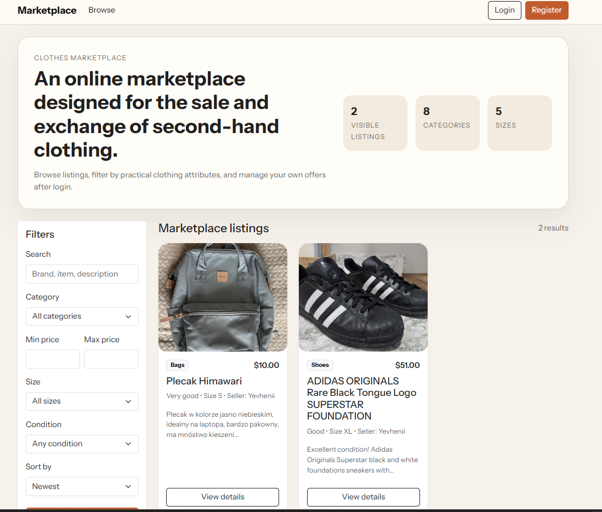
2. Aplikacja wyświetla listę aktywnych ogłoszeń.
3. Użytkownik może użyć filtrów po lewej stronie.
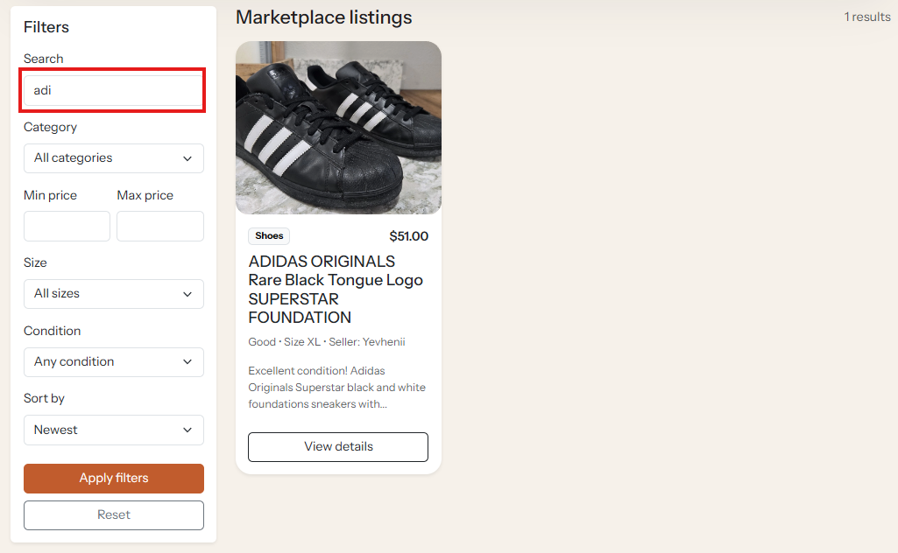
4. Po kliknięciu przycisku View Details użytkownik przechodzi do strony szczegółów.
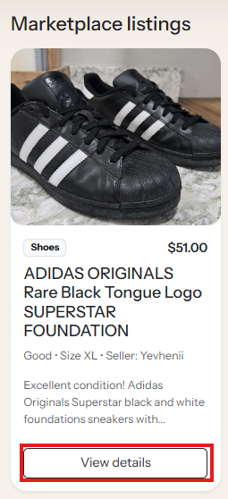
5. Na stronie szczegółów widoczne są: tytuł, cena, kategoria, rozmiar, stan, opis, zdjęcia, dane sprzedającego, czas
   publikacji.
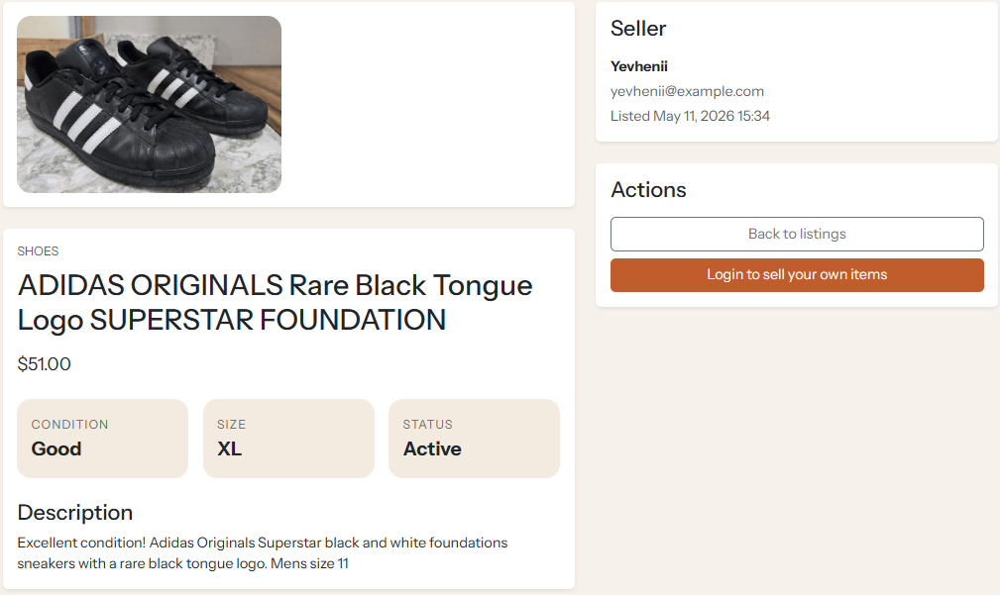


### Obsługiwane filtry
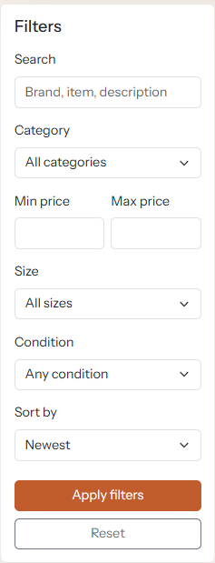

System pozwala filtrować ogłoszenia według:

- tekstu wpisanego w wyszukiwarce;
- kategorii;

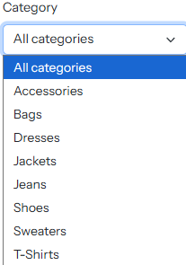

- minimalnej ceny;
- maksymalnej ceny;
- rozmiaru;

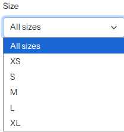

- stanu produktu;

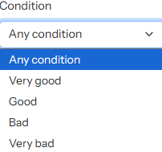

oraz sortować za:

- ogłoszeniem najnowszym;
- ogłoszeniem najstarszym;
- ceną rosnąco;
- ceną malejąco.

### Jak dziala filtrowanie danych?

Filtrowanie działa na podstawie parametrów przesłanych w adresie URL. Formularz filtrów wysyła dane metodą GET.
Kontroler odbiera parametry, waliduje je w klasie requestu, a następnie buduje zapytanie do bazy danych. Dzięki temu
użytkownik widzi tylko ogłoszenia spełniające wybrane kryteria.

---

## Dodawanie nowego ogłoszenia

1. Użytkownik musi zalogować się do systemu.

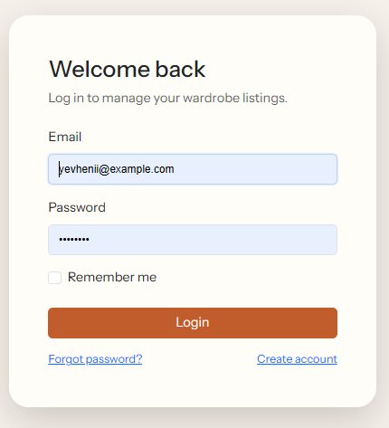
2. Użytkownik klika na przycisk `Sell Item` w nav-barze.
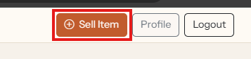
3. Aplikacja wyświetla formularz tworzenia ogłoszenia.
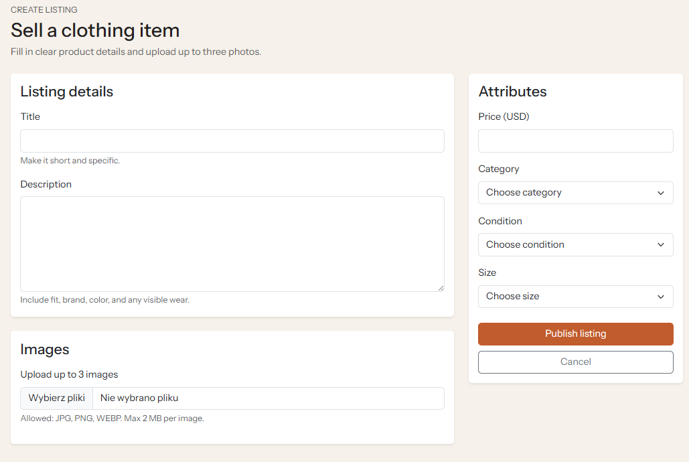
4. Użytkownik uzupełnia dane:
    - tytuł;
    - opis;
    - cenę;
    - kategorię;
    - stan produktu;
    - rozmiar;
    - zdjęcia.
5. Aplikacja sprawdza poprawność danych.
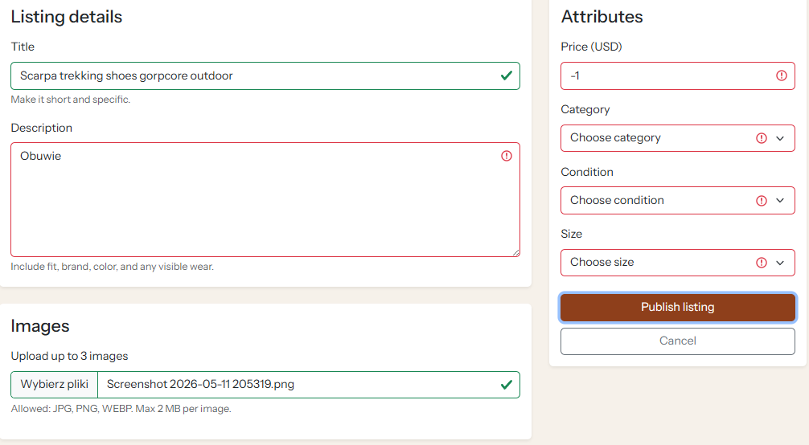
6. Jeżeli dane są poprawne, ogłoszenie zostaje zapisane w bazie danych.
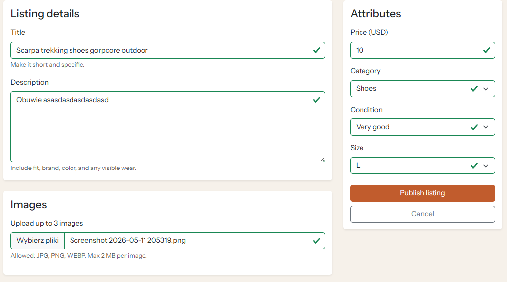
7. Użytkownik zostaje przekierowany na stronę szczegółów nowego ogłoszenia.
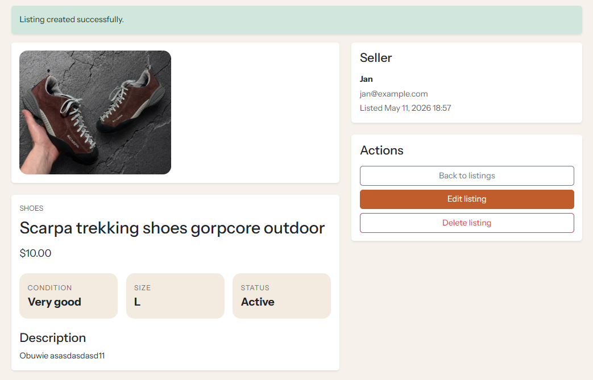
8. Ogłoszenie pojawia się na publicznej liście ogłoszeń.
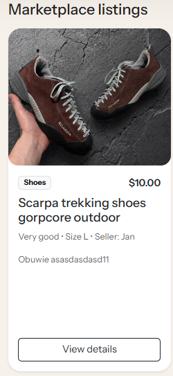

### Walidacja formularza ogłoszenia

System sprawdza między innymi:

- czy tytuł nie jest pusty;
- czy opis ma minimum 20 znakow;
- czy cena jest liczbą dodatnią;
- czy wybrano istniejącą kategorię;
- czy stan produktu znajduje się na liście dozwolonych wartości;
- czy rozmiar znajduje się na liście dozwolonych wartości;
- czy przesłane pliki są obrazami;
- czy liczba zdjęć nie przekracza dopuszczalnego limitu.

---

## Edycja i usunięcie ogłoszenia

1. Użytkownik loguje się do systemu.
2. Użytkownik klika przycisk `My Dashboard`.
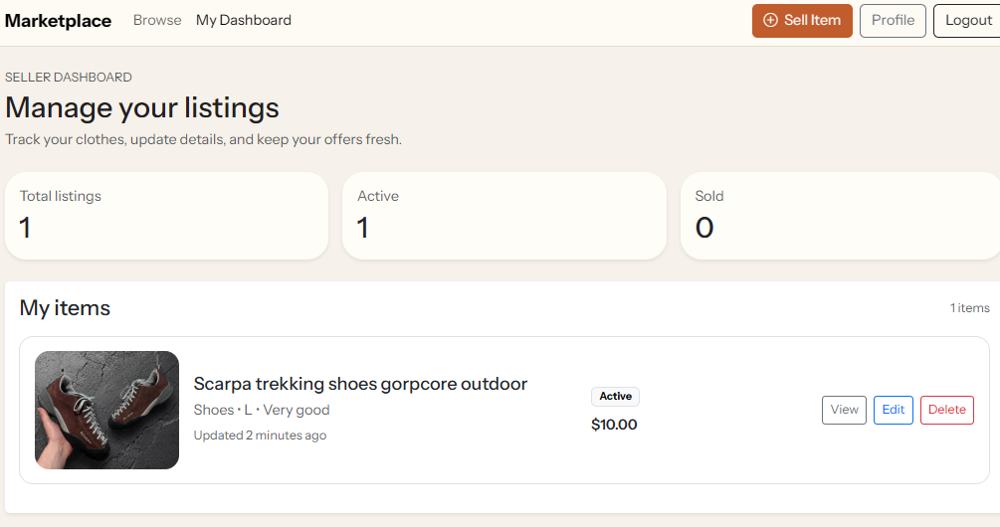
3. Aplikacja wyświetla listę ogłoszeń należących do zalogowanego użytkownika.
4. Użytkownik klika `Edit`.
5. Aplikacja wyświetla formularz z aktualnymi danymi.
6. Użytkownik zmienia dane i zapisuje formularz.
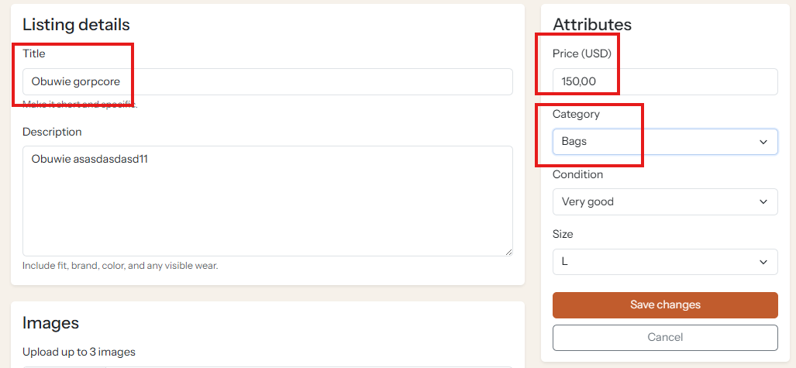
7. Aplikacja sprawdza poprawność danych i zapisuje zmiany w bazie.
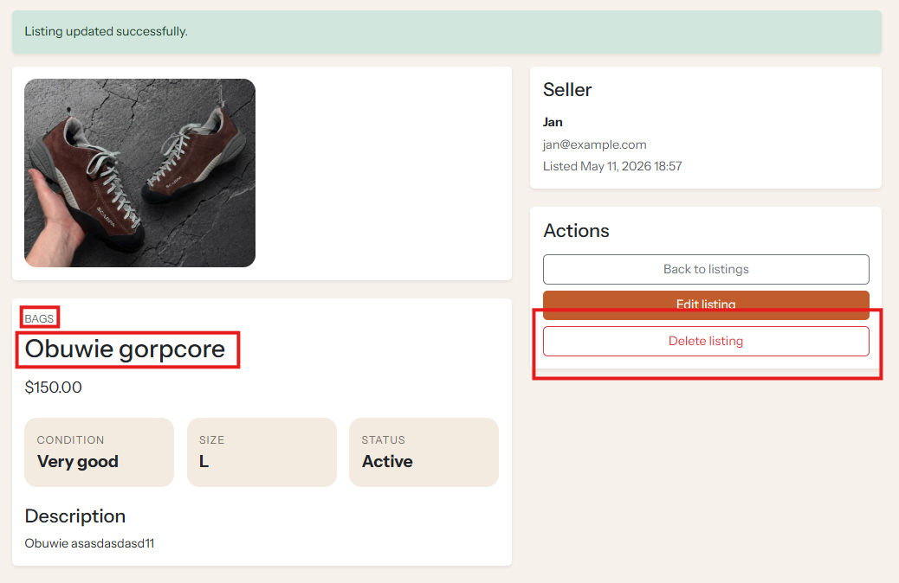
8. Jeżeli użytkownik chce usunąć ogłoszenie, system pokazuje stronę potwierdzenia.
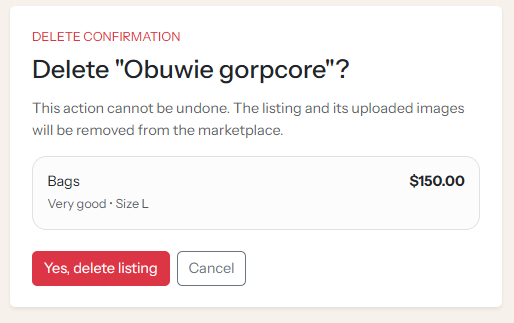
9. Po potwierdzeniu ogłoszenie oraz jego zdjęcia zostają usunięte.
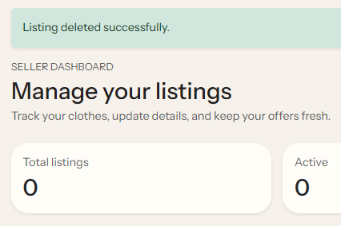
### Obsługa zdjęć

Zdjęcia ogłoszeń są zapisywane w katalogu storage aplikacji. W bazie danych przechowywana jest ścieżka do pliku, a nie
cały plik binarny. Dzięki temu baza danych pozostaje mniejsza, a pliki mogą być obsługiwane przez system plików.

Jeżeli użytkownik doda zdjęcia, system zapisuje je w katalogu:

```
storage/app/public/listings
```

---

## Panel administratora
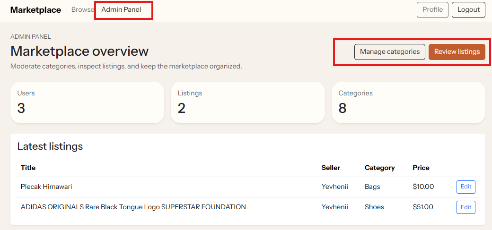
1. Administrator loguje się na konto z rolą `admin`.
2. Aplikacja automatycznie przekieruje na panel admina lub można kliknąć przycisk `Admin Panel` w nav-barze.
3. Aplikacja wyświetla panel administracyjny.
4. Administrator może przejść do zarządzania kategoriami.
5. Administrator może przejść do listy wszystkich ogłoszeń.
6. Administrator może zobaczyć ilość użytkowników, ogłoszeń, kategorii, ostatnie ogłoszenia.

### Zarządzanie kategoriami
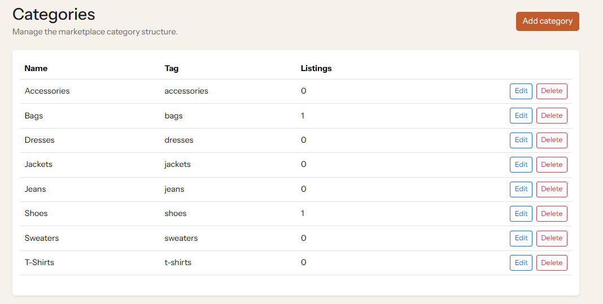
Administrator może:

- dodać nową kategorię;

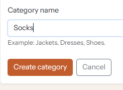
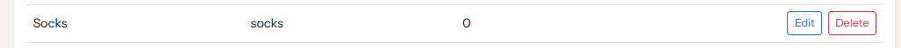
- edytować nazwę kategorii;

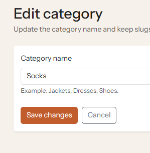
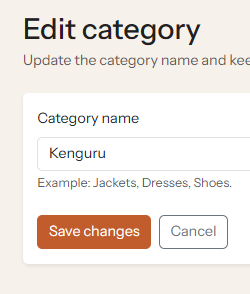
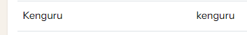
- usunąć kategorię (nie można usunąć kategorię wykorzystaną w ogloszeniach);

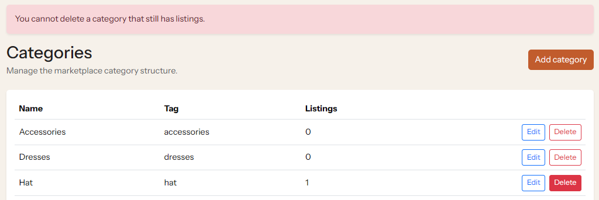
- przeglądać ilość ogłoszeń z każdą kategorią.

Kategorie są wykorzystywane w formularzu dodawania ogłoszenia oraz w filtrach publicznej listy ogłoszeń.

### Zarządzanie ogłoszeniami
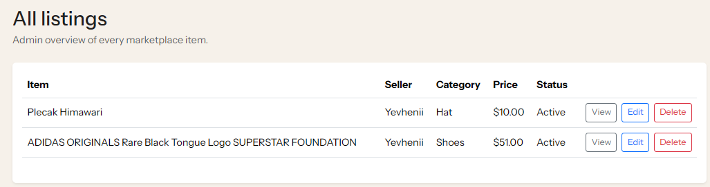
Administrator może:

- zobaczyć szegoly wszystkich ogłoszen w systemie;
- edytować dowolne ogłoszenie;
- usunąć ogłoszenie np. naruszające zasady aplikacji.

brak podtwierdzenia usunięcia, view i edit podobne jak u zwyklego uzytkownika

---

## Przypadki brzegowe obsługiwane przez system

### Brak danych w formularzu

Jeżeli użytkownik nie uzupełni wymaganych pól, system nie zapisuje formularza i pokazuje błędy walidacji.

### Niepoprawna cena

Pole ceny powinno zawierać liczbę dodatnią. Jeżeli użytkownik wpisze tekst albo wartość niepoprawną, formularz zostanie
odrzucony.

### Niepoprawny plik zdjęcia

Jeżeli przesłany plik nie jest obrazem, aplikacja nie zapisze go (przy wyborze zdjęcia z komputera nie jest możliwym wybór nie zdjęcia).

### Usuwanie ogłoszenia ze zdjęciami

Przy usuwaniu ogłoszenia system usuwa również powiązane pliki zdjęć oraz rekordy z tabeli `listing_images`.

### Usuwanie kategorii powiązanej z ogłoszeniami

Relacja w bazie danych chroni przed przypadkowym usunięciem kategorii, która jest używana przez istniejące ogłoszenia.

---

## Responsywność

Desktopowa wersja stróny głównej
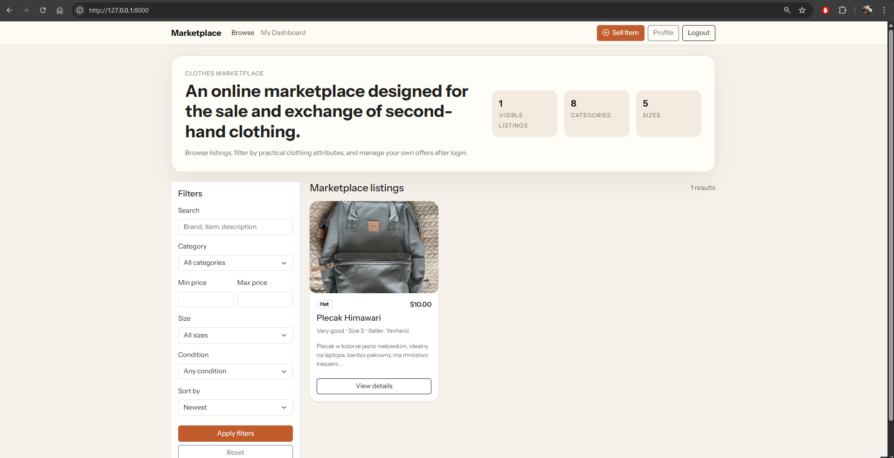

Mobilna:

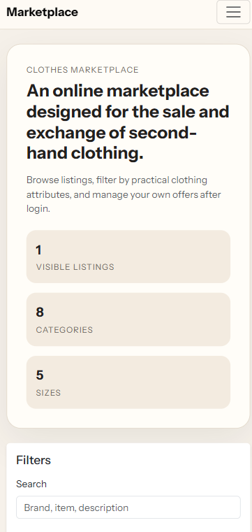
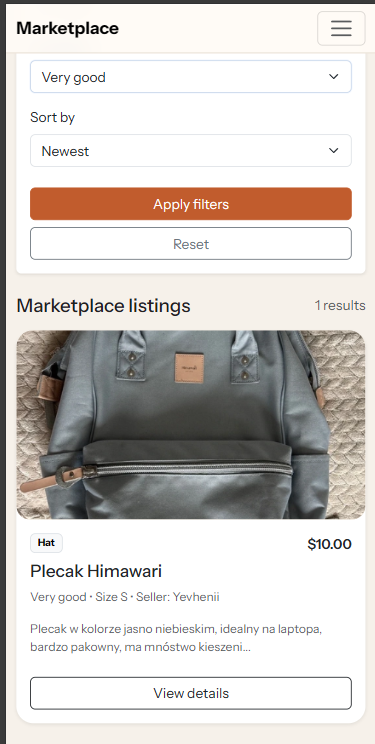
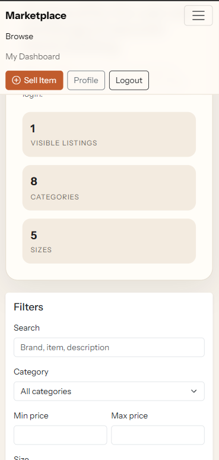

zdjecia zrobione za pomocy F12

---

## Plany rozbudowy

### Czego zabrakło w teraźniejszej wersji projektu?

W projekcie braknie bardziej zaawansowanych mechanizmów typowych dla dużych marketplace,
takich jak płatności online, system wiadomości między użytkownikami,
zachowane ogłoszenia oraz pełna moderacja treści.

### Funkcjonalności możliwe dla ulepszenia projektu

W kolejnej wersji można dodać:

1. System wiadomości między kupującym i sprzedającym.
2. Dodawanie ogłoszeń do zapisanych.
3. Integrację z płatnościami online.
4. Zaawansowaną galerię zdjęć.
5. Opinie o sprzedających.
